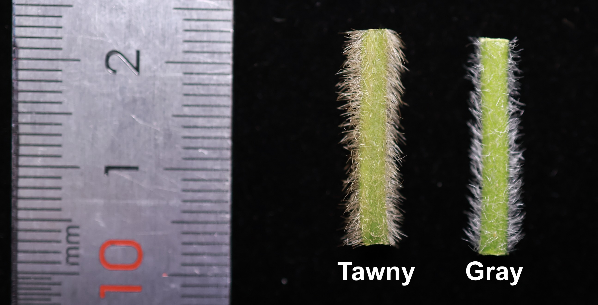
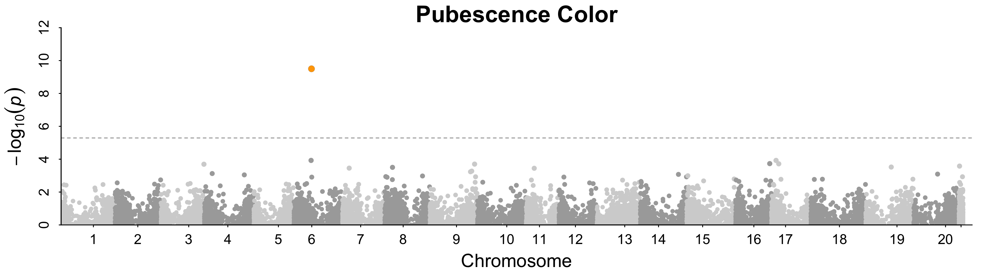
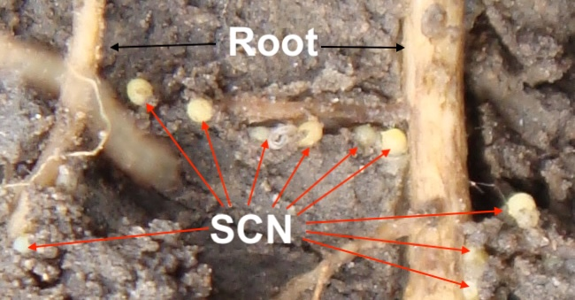
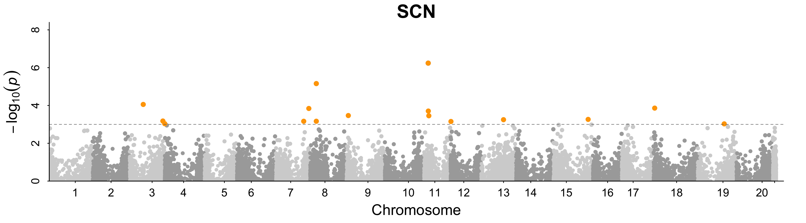

# A Practical Guide to Proteome-Wide Association Study (PWAS) in Plants: The Soybean Example

A Proteome-Wide Association Study (PWAS) that directly tests the association between measured protein abundance and a trait within a diversity panel is termed **direct PWAS**, distinguishing it from **indirect PWAS**, an approach common in human genetics that integrates pQTL and GWAS results.

This repository demonstrates how to prepare data for and perform a **direct PWAS** in plants, using soybean pubescence color and soybean cyst nematode (SCN) resistance as example traits from a diversity panel of 200 soybean accessions. Guidance is also provided for integrating our previously published pQTL data with your own soybean GWAS results—an approach referred to as **indirect PWAS**.

- [Direct PWAS using measured protein data](#direct-pwas-using-measured-protein-data)
- [Perspectives for indirect PWAS](#perspectives-for-indirect-pwas)
- [FAQ](#faq)    
- [Citation](#citation)

## Direct PWAS using measured protein data

Direct PWAS examines associations between measured protein abundance and phenotypic traits within a single diversity panel. While this is challenging in human or animal studies, it is readily achievable in plants due to the availability of inbred lines that maintain stable genotypes across generations.

### 1. Requirements for R and packages

- [R](https://www.r-project.org/)

- [Rstudio](https://www.rstudio.com/) (R editor, recommended but not required)

- **GAPIT** by **[Zhiwu Zhang Lab](https://zzlab.net)** 
  
  ```
  #installation of GAPIT  
  source("http://zzlab.net/GAPIT/gapit_functions.txt")
  ```

### 2. Data preparation for PWAS

#### 2.1 Raw protein abundance data

The raw protein abundance data were generated from the V2 stage seedling shoot tissue of 200 soybean accessions grown under uniform environmental conditions. The data matrix was acquired using an Astral data-independent acquisition mass spectrometry platform (60 samples per day method) and is publicly available on [FigShare](https://doi.org/10.6084/m9.figshare.30997609). The file name is: **Soybean.200Samples.Protein.Abundance.ProID.Wm82Assigned.csv**.

#### 2.2 Converting raw protein abundance into PWAS input format

The protein abundance matrix was converted into a numeric format compatible with GAPIT using the following R code (see `example/data/`):

```
# Protein.Matrix each row is a protein, eacho column is a soybean accession 
NumericGenoTypeMatrix<- apply(Protein.Matrix,1,
                         function(A){min_x=as.numeric(quantile(A,0.05));
                         max_x=as.numeric(quantile(A,0.95));
                         out<-(2*(A-min_x)/(max_x-min_x));
                         out[out>2]<-2;out[out< 0]<- 0;return(out)})
```

Alternative tools, such as [GEMMA](https://github.com/genetics-statistics/GEMMA), may also be used provided they support linear numeric formatting for variants.
The resulting numeric protein abundance file, analogous to a genotype file where proteins serve as molecular markers, is available as `example/data/Pro.geno.txt.gz`, accompanied by a corresponding coordinate file `example/data/Pro.map.txt.gz`.

#### 2.3 Phenotype and sample information

Sample metadata and phenotype data are provided in `example/data/Sample.Information.Phenotype.TableS1.txt`.

### 3. Soybean pubescence color PWAS

Soybean pubescence color is a qualitative trait known to be controlled by two known loci; tawny versus gray (in our study) is specifically controlled by the soybean *T* gene.

##### Pubescence Color



##### Key R code (full script available in `example/PWAS.R`)

```
## 1. conduct PWAS, see data prepare in script PWAS.R
myGAPIT <- GAPIT(Y=Phenotype,
                 GD=myGD, # numeric format genotype-like data converted from protein abundance 
                 GM=myGM, # the protein coordinated with three column (protein,Chr,position)
                 PCA.total=3, 
                 model= "CMLM", # can try with different model provided by GAPIT
                 SNP.MAF=0.05,
                 file.output=F
)

write.csv(myGAPIT$GWAS,"Soybean.PWAS_Seedling_PubescenceColor.CMLM.Results.csv",row.names = F)

## 2. The assocaited protein
print(myGAPIT$GWAS[which.min(myGAPIT$GWAS$P.value),] )
# should be the known protein T (ID  Glyma.06G202300.1.p) with a P.value of "3.166518e-10"

## 3. The Manhattan plot of Pubescence Color PWAS 
png("Soybean.PWAS_Seedling_PubescenceColor.CMLM.png", width = 18,height=5,units = "in",res = 200)
layout(matrix(1:1, 1, 1, byrow = TRUE))
par(mar = (c(4.2,5,2,2)+ 0.5), mgp=c(3,1.8,0))    
par(bty="l", lwd=1.5)   

GAPIT.Manhattan.plot(myGAPIT$GWAS[,-1] ,name.of.trait= "Pubescence Color", cutOff= 0.1 / nrow(myGAPIT$GWAS) ,cex.sig = 2,
                     highliht.sig=T,color1="lightgrey", color2="darkgrey",  
                     cex.lab=2,color1.sig="#FFA500", color2.sig="#FFA500")  

dev.off()
```

Your PWAS results is expected to be same with our published results: `example/results/Soybean.PWAS_Seedling_PubescenceColor.CMLM.Results.csv.gz`. And the expected Manhattan plot for the pubescence color PWAS is shown below:



### 4. Soybean Soybean Cyst Nematode (SCN) PWAS

Soybean cyst nematode (*Heterodera glycines*) is a soil-borne pathogen that infects soybean **roots**, causing soybean yield losses. Resistance to SCN is a **quantitative trait**, which meaning it is governed by multiple genetic loci. And its assessment requires deliberate exposure of plants to the nematode. 
However, the proteome data used in this study were derived from **seedling shoot tissue** of plants that were **neither infected with SCN nor grown under nematode pressure**. Despite this clear disconnect between the source tissue and the trait-relevant tissue and condition, our PWAS successfully identified two protein associations linked to SCN resistance. 

##### Soybean SCN infection:



Your PWAS results are expected to be exact same with `example/results/Soybean.PWAS_Seedling_SCN.CMLM.Results.csv.gz`.  And should identify the two known SCN resistance protein as below:

```
# the expected two known SCN resistance proteins
Glyma.07G195900.1.p (NSF07) P.value 6.85e-04
SoyL02_18G021000.m1 (Rhg1/Glyma.18G022500) P.value 1.38e-04
```

Below is the manhatton plot of SCN PWAS.



## Perspectives for Indirect PWAS

Indirect PWAS involves integrating our pQTL summary statistics with your own GWAS results—an approach commonly employed in human and animal studies. Three primary analytical strategies are available: **colocalization**, **Mendelian randomization (MR)**, and **FUSION**. 

- **Colocalization** can be implemented immediately using your pQTL summary statistics.  
- **Mendelian randomization (MR)** requires careful selection of instrumental variables and thorough sensitivity analyses.  
- **FUSION** depends on appropriately formatted LD reference panels and pre‑computed expression weights, of which you need prepare in your own with our data.

**Colocalization** tests whether the same genetic variant(s) drive both pQTL and GWAS signals at a given genomic locus. It computes posterior probabilities for competing hypotheses—most notably, whether a single shared causal variant underlies both associations rather than distinct variants in linkage disequilibrium. This method does not require summary-level LD reference data, making it the most straightforward option to apply directly. Example tool: R package **coloc**.

**Mendelian Randomization (MR)** uses genetic variants (typically pQTLs) as instrumental variables to infer causal effects of protein expression on a trait of interest. Valid inference rests on three core assumptions: the instruments must be robustly associated with the exposure (protein abundance), independent of confounders, and influence the outcome only through the exposure. MR provides directional estimates, helping to distinguish whether changes in protein expression drive phenotypic variation. Example Tool : [**SMR**](https://yanglab.westlake.edu.cn/software/smr/#Download) from the **[Yang Lab](https://yanglab.westlake.edu.cn)**.
**FUSION** builds predictive models of protein expression from genetic data using a reference panel that includes both genotypes and measured protein levels. These models are subsequently applied to GWAS summary statistics to impute protein–trait associations. Unlike colocalization and MR, FUSION requires pre‑computed expression weights and LD reference data, but it can detect associations even when the causal variant itself is not directly genotyped. Example Tool: [**FUSION**](http://gusevlab.org/projects/fusion/) from the **[Gusev Lab](http://gusevlab.org)**.

## FAQ

We welcome any questions that may help make PWAS more accessible to the plant research community.  Contact Email:  `delin.bio_at_gamil.com`

#### 1. How should I select the tissue from which protein abundance is measured?

**Answer:** Protein abundance for a given genotype varies across organs, tissues, environments, and developmental stages. Ideally, one should use proteome data derived from tissue(s) relevant to the trait of interest. However, practical limitations—such as difficulty in extracting proteins from certain tissues or budget constraints—often necessitate using a single tissue source for multiple traits within a natural diversity panel, as was done in our study. 

We used seedling shoot tissue for two primary reasons: (1) seedling‑stage tissue has successfully identified genes associated with a broad range of traits in our previous transcriptome‑wide association studies (TWAS); (2) this approach allowed us to control environmental conditions tightly and collect all samples within a narrow ~2‑hour window for a panel exhibiting wide variation in plant architecture, flowering time, and yield‑related traits—thereby minimizing environmental and other batch effects.

In our PWAS study, both traits for which we recovered known causal genes (pubescence color and SCN resistance) are not directly manifested in seedling shoot tissue. Pubescence color is not discernible at the V2 seedling stage, and the plants were neither challenged with SCN nor sampled with the root tissue. Nevertheless, we successfully detected the established causal genes. This finding aligns with our experience in TWAS across multiple species ([*Arabidopsis*, maize](https://doi.org/10.1093/plphys/kiab161), [soybean](https://doi.org/10.1016/j.xplc.2024.101010), and wheat (unpublished)), which indicates that while using trait‑relevant tissue is optimal, causal genes can still be identified using proteome data from unrelated tissues.

#### 2. My soybean trait is not directly related to **seedling shoot tissue**. Can I still use these pQTL data for colocalization?

**Answer:** **Yes.** The optimal approach is to use proteome data from the tissue most relevant to your trait. However, our study successfully recovered known genes for traits (including disease resistance) using a non‑target tissue. It is certainly worth attempting, but be aware of poteintial higher false-positve and false-negative caused by not relavant tissue.

#### 3. Does the numerical conversion method affect the results?

**Answer:** **Yes.** We employed quantile transformation, an approach adapted from our TWAS work ([Li et al. 2021](https://doi.org/10.1093/plphys/kiab161)). Quantile transformation was chosen over simple linear scaling to mitigate the influence of outliers. This method performs well in most scenarios, though it may produce false negatives when true biological outliers are rare. As an alternative, you may consider applying a QQ‑normalization strategy to transform protein abundance values; this approach is frequently used in eQTL and pQTL studies.

#### 4. Does the choice of statistical model influence PWAS results?

**Answer:** **Yes.** Based on our experience, no single statistical model is universally optimal across all trait architectures. We therefore recommend exploring multiple models to identify the approach best suited to your specific dataset and study objectives. Below, we offer guidance on two models frequently employed in plant association studies:

- **Mixed Linear Model (MLM):** Well-suited for qualitative traits and quantitative traits with moderate to high heritability.

- **FarmCPU:** This model offers enhanced statistical power for complex traits with low heritability. However, because FarmCPU iteratively includes associated markers as covariates, it may inadvertently suppress genuine associations in PWAS. While this built‑in control for confounding is highly effective in standard SNP‑based GWAS, it can lead to false negatives in PWAS analyses—**signals that conventional Mixed Linear Models may retain.**

---

## Citation

If you use the data or the direct PWAS strategy presented in this repository, please consider to cite our **coming paper**:

Li, D., Li, Z., Guo, S., Wang, Q., Feng, X., Zhang, H., Schnable, J. C., Li, Y.-H., Qiu, L.-J. (2026) From DNA to RNA to protein: pQTL mapping and Proteome-Wide Association Study uncover protein-level drivers of soybean traits. *under review*.
